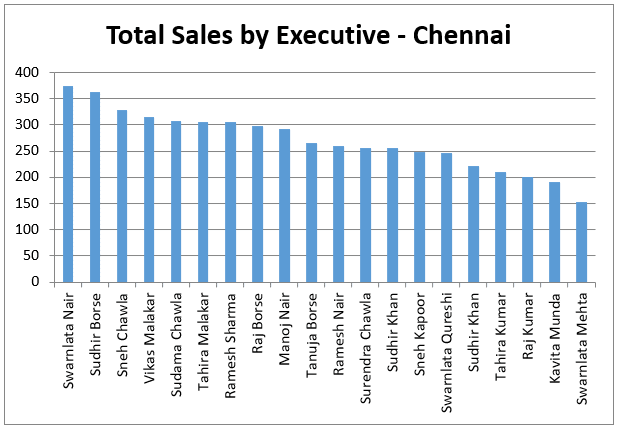

# 📊 Sales Executive Performance Dashboard (Excel)

## 📌 Project Overview
This project presents an interactive "Sales Executive Performance Dashboard" built using "Microsoft Excel". The dashboard helps analyze sales performance across multiple cities, monitor individual sales executives, and measure target achievement through dynamic reports and visualizations.

---

## 🎯 Objective
The objective of this dashboard is to:
- Monitor sales performance by city.
- Track individual sales executive performance.
- Measure target achievement percentage.
- Compare daily and total sales.
- Support data-driven business decisions.

---

## 🛠️ Tools & Features
- Microsoft Excel
- Pivot Tables
- Pivot Charts
- Excel Formulas
- KPI Metrics
- Interactive Dashboard
- Data Analysis

---

## 📈 Dashboard Features
- Sales Performance by City
- Daily Sales Analysis (Day 1–Day 5)
- Total Sales Calculation
- Target Hit Percentage
- Sales Executive Performance Comparison
- Interactive Charts
- Easy-to-read Dashboard Layout

---

## 📊 Key KPIs
- Total Sales
- Target Achievement %
- Sales by Executive
- City-wise Performance
- Daily Sales Trend

---

## Dashboard Preview

The Excel workbook contains multiple interactive dashboards. Please refer to the Excel file for the complete set of dashboards.

### Dashboard 1


---

## 📂 Repository Structure

```
Sales-Executive-Performance-Dashboard-Excel/
│
├── Sales_Executive_Perfrmance_Dashboard.
├── dashboard.
└── README.md
```

---

## 💡 Business Value
This dashboard enables business managers to:
- Identify top-performing sales executives.
- Track sales targets efficiently.
- Monitor city-wise performance.
- Make informed business decisions using visual insights.

---

## 👤 Author
"Lokesh Sekhar"

Business Analyst | Excel | SQL | Power BI | Tableau | Data Analytics
